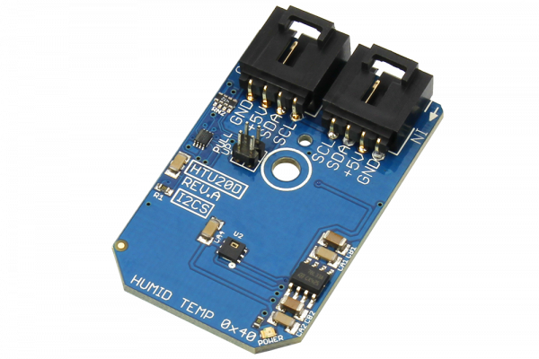

# HTU20D

HTU20D is a new digital humidity sensor with temperature output of MEAS.This sensor provides calibrated, linearized signals in digital, I2C format. HTU20D digital humidity sensors are dedicated humidity and temperature plug-n-play transducers for OEM applications (where reliable and accurate measurements are needed).The resolution of this digital humidity sensor can be changed by command (8/12bit up to 12/14bit for RH/T).
This Device is available from www.ncd.io 

[SKU: HTU20D_I2CS]

(https://store.ncd.io/product/htu20d-humidity-and-temperature-sensor-%C2%B13rh-%C2%B10-3c-i2c-mini-module/)
This Sample code can be used with Arduino.

Hardware needed to interface HTU20D sensor with Arduino

1. <a href="https://store.ncd.io/product/i2c-shield-for-arduino-nano/">Arduino Nano</a>

2. <a href="https://store.ncd.io/product/i2c-shield-for-arduino-micro-with-i2c-expansion-port/">Arduino Micro</a>

3. <a href="https://store.ncd.io/product/i2c-shield-for-arduino-uno/">Arduino uno</a>

4. <a href="https://store.ncd.io/product/dual-i2c-shield-for-arduino-due-with-modular-communications-interface/">Arduino Due</a>

5. <a href="https://store.ncd.io/product/htu20d-humidity-and-temperature-sensor-%C2%B13rh-%C2%B10-3c-i2c-mini-module/">HTU20D Humidity and Temperature Sensor</a>

6. <a href="https://store.ncd.io/product/i%C2%B2c-cable/">I2C Cable</a>

HTU20D:

HTU20D is a new digital humidity sensor with temperature output of MEAS.This sensor provides calibrated, linearized signals in digital, I2C format. HTU20D digital humidity sensors are dedicated humidity and temperature plug-n-play transducers for OEM applications (where reliable and accurate measurements are needed).The resolution of this digital humidity sensor can be changed by command (8/12bit up to 12/14bit for RH/T).

Applications:

• Home Appliance

• Medical

• Printers

• Humidifier

• Multimedia: Smartphone, Tablet and etc.

How to Use the HTU20D Arduino Library

The HTU20D has a number of settings, which can be configured based on user requirements.
          
1.Resolution setting:The following command is used to set the resolution of sensor for humidity and temperature.

             htu.setResolution(RESOLUTION_0);             // RH: 12 bit, Temp: 14 bit
            
2.Voltage setting:The following command is used to set the voltage.

              htu.setVoltage(VOLTAGE_OK);                  // VDD OK
              
3.Heater status:The following command is used to set the heater enable.          
              
              htu.setHeaterStatus(HEATER_ENABLE);          // On-chip Heater Enable
              
4.OTP status:The following command is used to set the OTP status as Disable.            
              
              htu.setOTPStatus(OTP_DISABLE);               // OTP Reload Disable
              
5.Temperature mode:The following command is used to measure the temperature and set NO HOLD Master Mode.            
              
              htu.setTempMode(TEMP_NO_HOLD);               // Measure Temperature, No Hold Master Mode
              
6.Humidity mode:The following command is used to measure the humidity and set NO HOLD Master Mode.            
              
               htu.setHumidityMode(HUMIDITY_NO_HOLD);       // Measure Humidity, No Hold Master Mode

